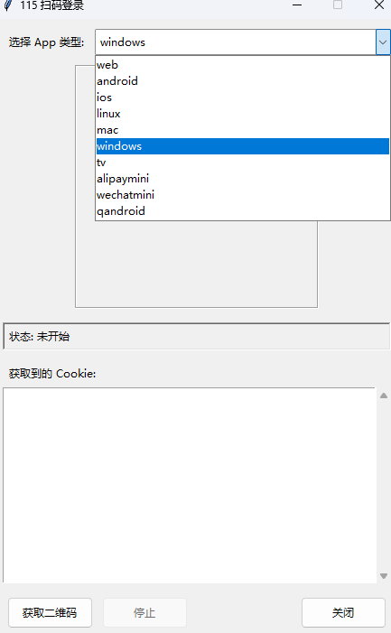

# 115 扫码登录助手 (GUI版) - 修改版

这是一个基于 **[ChenyangGao](https://chenyanggao.github.io)** 原版代码修改而来，我进行改进增加了 Python 和 Tkinter 编写的图形用户界面 (GUI) 工具，用于通过扫描二维码的方式获取 115 网盘的登录 Cookie，可以在界面上选择app类型。

## 预览



## 功能

* **获取登录二维码**：从 115 服务器获取用于登录的二维码。
* **显示二维码**：在界面上清晰地展示二维码，方便用户使用 115 手机 App 扫描。
* **轮询扫码状态**：自动检测二维码的状态（未扫描、已扫描、已确认、已过期、已取消）。
* **获取指定 App Cookie**：登录成功后，根据用户选择的 App 类型（如 `web`, `windows`, `android` 等）获取对应的 Cookie。
* **图形用户界面**：提供简单易用的图形界面，方便操作。
* **App 类型选择**：允许用户选择需要模拟登录并获取 Cookie 的客户端类型。
* **状态显示**：实时显示当前操作状态（如“正在获取 Token...”, “等待扫码...”, “登录成功!”等）。
* **Cookie 展示**：成功获取后，在文本框中显示完整的 Cookie 字符串。
* **界面布局优化**：(由 Tonyhzk 修改) 调整了界面元素布局，使其更规整。
* **错误处理增强**：(由 Tonyhzk 修改) 可能改进了部分错误提示和处理逻辑。  *（请根据实际修改确认或调整此点）*

## 依赖

* **Python 3**: 脚本需要 Python 3 环境。
* **Pillow**: 用于处理和显示二维码图片。

## 安装依赖

如果你的环境中没有安装 Pillow 库，请使用 pip 安装：

‍`pip install Pillow ‍`

## 如何使用

1. **确保环境**：确保你的计算机已安装 Python 3 和 Pillow 库。
2. **下载代码**：从本仓库下载代码或使用 `git clone`。
3. **运行脚本**：在终端或命令行中，进入代码所在目录，使用 Python 运行此脚本：
    ‍```bash

    qrcode_Scan_cookie_115_GUI.py
    ‍```<br />
4. **选择 App 类型**：在程序顶部的下拉菜单中，选择你想要获取 Cookie 的目标 App 类型（默认为 `windows`）。不同的 App 类型可能会获取到略有不同的 Cookie 或权限。
5. **获取二维码**：点击“获取二维码”按钮。
6. **等待显示**：程序将请求 115 服务器，下载并显示二维码。状态栏会提示“等待扫码...”。
7. **手机扫码**：打开你的 115 手机 App，使用扫一扫功能扫描电脑屏幕上显示的二维码。
8. **手机确认**：根据手机 App 的提示，确认登录。状态栏会更新为“已扫描，请在手机上确认登录...”。
9. **获取 Cookie**：一旦你在手机上确认登录，程序会自动检测到状态变化（“已确认登录! 获取 Cookie...”），然后请求最终的登录信息，并在下方的文本框中显示获取到的 Cookie。状态栏会提示“登录成功!”。
10. **复制 Cookie**：你可以从文本框中复制所需的 Cookie 信息。
11. **停止/关闭**：

     * 在登录成功前，如果想中断操作，可以点击“停止”按钮。
     * 完成后，点击“关闭”按钮退出程序。

## 修改说明 (by Tonyhzk)

* 主要针对原版代码进行了GUI界面布局的设计，使用了 `ttk.Frame` 来固定二维码显示区域大小等。

## 注意事项

* **Cookie 有效期**：通过此方法获取的 Cookie 具有一定的有效期，过期后需要重新获取。
* **API 风险**：此工具依赖于 115 的公开 API。如果 115 更改了 API 接口，此工具可能会失效。请关注项目更新或自行适配。
* **网络问题**：网络连接不稳定可能导致获取二维码、查询状态或获取 Cookie 失败。程序包含基本的错误处理和超时机制。
* **仅供学习**：此脚本主要用于学习和研究目的，请勿用于非法用途。使用本工具产生的任何后果由使用者自行承担。

## 作者与贡献者

* **原作者:**  ChenyangGao ([https://chenyanggao.github.io](https://chenyanggao.github.io))
* **修改者:**  Tonyhzk ([https://github.com/Tonyhzk](https://github.com/Tonyhzk))